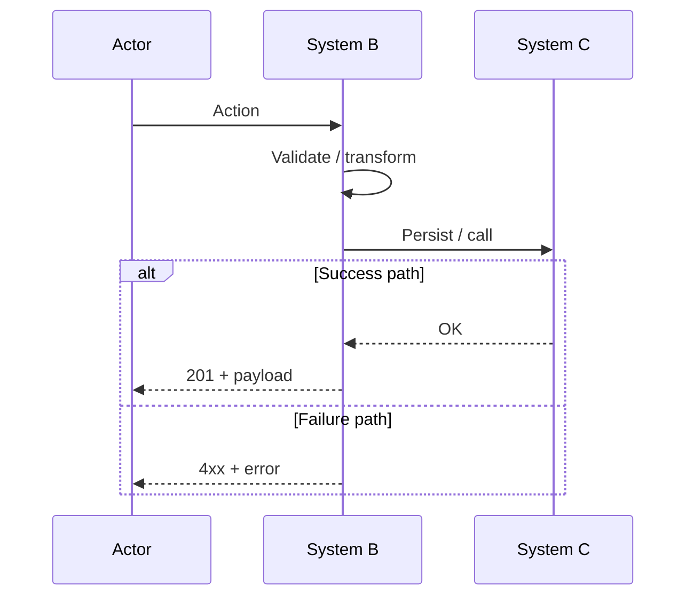
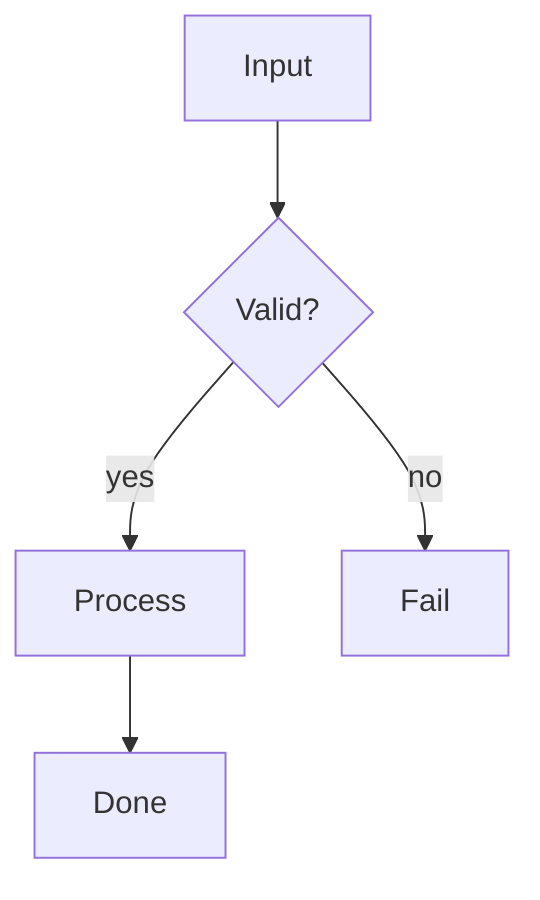
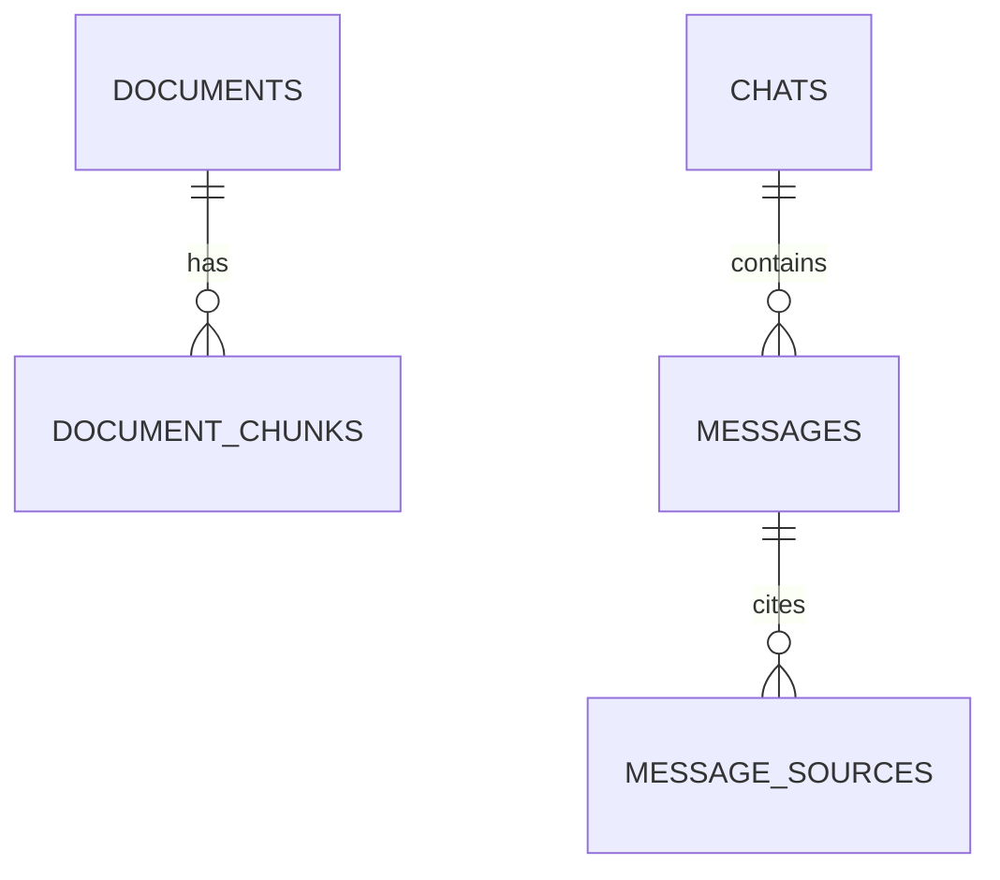

# Mermaid Diagrams

Prefer **Mermaid** in fenced `mermaid` code blocks for chat and markdown docs.
Cursor/GitHub render them natively. Do not invent a custom diagram DSL.

## When to diagram

Draw a diagram when:
- Explaining a multi-step flow (upload, auth, RAG, deploy)
- Comparing branches (`alt` / `else`, success vs failure)
- Showing actors across layers (UI → API → DB → S3 → LLM)
- Clarifying data model relationships

Skip diagrams for single-function answers or trivial 2-step linear paths.

## Choose the diagram type

| Need | Mermaid type |
|------|----------------|
| Request/response over time across services | `sequenceDiagram` |
| Decision trees, pipelines, status machines | `flowchart TD` (or `LR` if short) |
| Tables and FKs | `erDiagram` |
| High-level components | `flowchart TB` with subgraphs |
| State lifecycle (`uploading` → `indexed`) | `stateDiagram-v2` |

**Default for “how does X work end-to-end?”:** `sequenceDiagram`.

## Style rules (match Knowforge recap quality)

1. **Short participant aliases**, human labels:
   ```mermaid
   sequenceDiagram
       participant UI as Frontend (/upload)
       participant API as POST /api/documents/upload
   ```
2. **One happy path + real branches** with `alt` / `else` / `opt` — do not flatten everything into a straight line if the code has forks.
3. **Name real systems** from the codebase (S3, PostgreSQL, PGVector, OpenAI), not vague “Service A”.
4. **Keep it scannable:** ≤ ~25 interaction lines; split into two diagrams if larger.
5. **Language:** match the user’s language for labels and notes; keep code identifiers (`status=indexed`) as in the repo.
6. **No decoration noise:** avoid unused themes, emojis in nodes, or rainbow styling unless asked.
7. **After the diagram:** 3–7 bullet steps mapping diagram hops to files/functions when useful — do not restate the entire diagram in prose.

## Sequence diagram template



## Flowchart template (pipelines)



## ER template



## Quality checklist

Before sending:
- [ ] Correct Mermaid type for the question
- [ ] Participants/nodes match real layers in code
- [ ] Branches match real control flow (`alt`/`else` not fake)
- [ ] Identifiers match the repo (routes, status enums, table names)
- [ ] Renders conceptually without needing a legend of cryptic IDs
- [ ] Followed by short file/function mapping only if it adds value

## When not Mermaid

- User asks for an **editable Draw.io** file → use the Draw.io MCP / tools instead.
- User wants a **pixel/UI mock** → not this skill.
- Huge infra topology with dozens of boxes → summarize into 1 overview + 1 zoomed sequence, do not dump 50 nodes.

## Anti-patterns

- Giant walls of `Note over` that duplicate the arrows
- Generic names: `Backend`, `Database`, `Service` when the real names are known
- Mixing Spanish labels and English randomly in the same diagram without need
- `flowchart` for a timed request chain that is clearly a sequence
