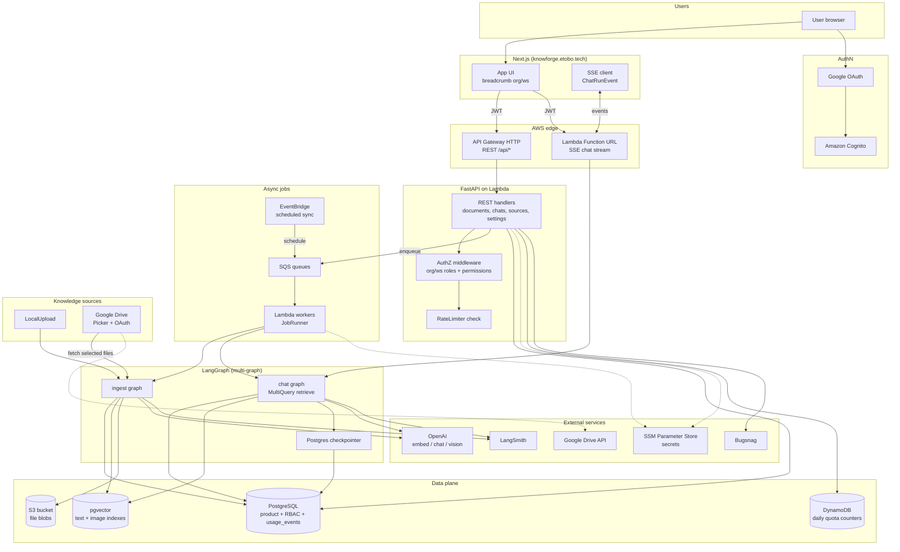
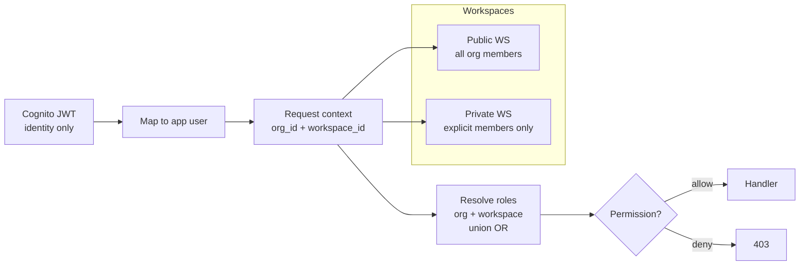
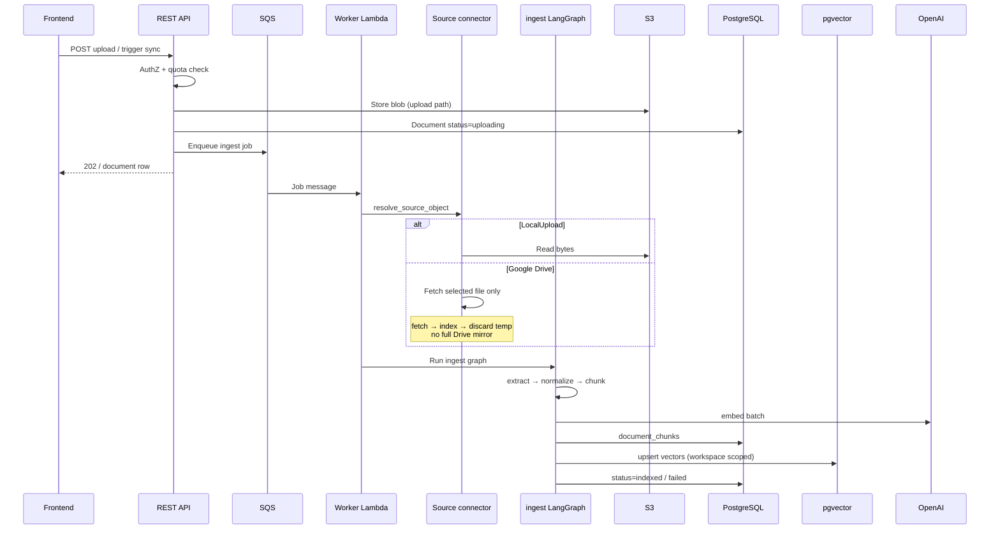
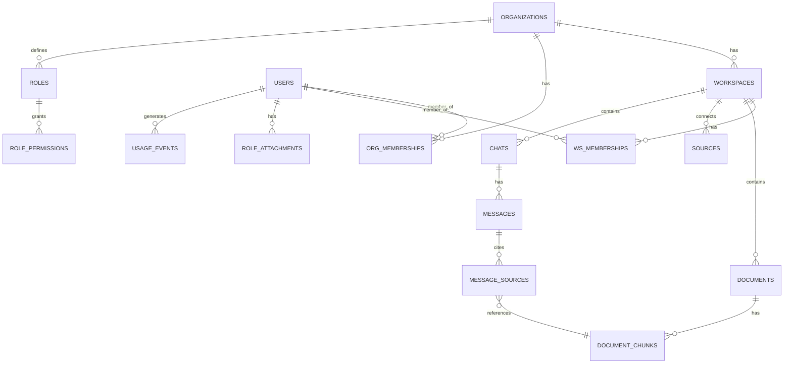
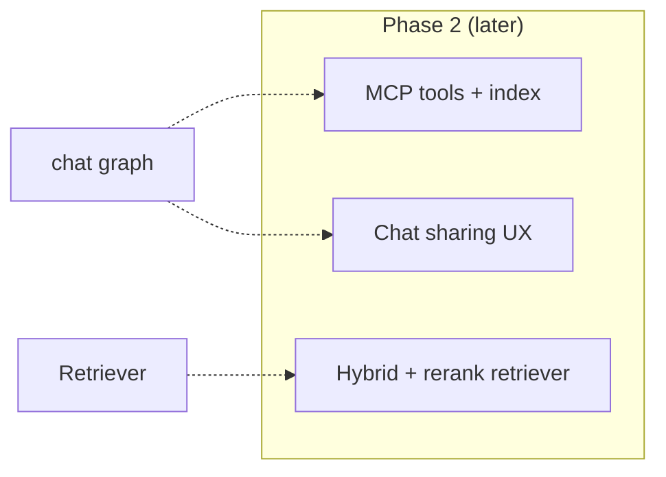

# Knowforge — Target Architecture (beta)

Visual reference for how the system works **after Phase 1** (external beta).  
Aligned with [`ROADMAP.md`](./ROADMAP.md) rev 3 and [`HANDOFF.md`](./HANDOFF.md).

**Today:** parts of this are still LlamaIndex + sync upload; see [§6 Current vs target](#6-current-vs-target).

---

## 1. System overview



**Read left → right:** user → front → edge → API/jobs → agents → data → external.

---

## 2. Tenancy & request context

Every authenticated request carries **org + workspace** context (from route/breadcrumb). AuthZ runs in the app DB, not Cognito.



- **Public workspace:** implicit access for all org members (read/chat/upload per role).
- **Private workspace:** only listed members; org owner/admin creates it.
- **Chat:** scoped to **one** workspace; retrieval never crosses workspaces.

---

## 3. Ingest flow (upload or Drive sync)

Indexing is **async** (not blocking the HTTP response).



**Ingest graph nodes:** `resolve_source_object` → `extract` → `normalize` → `chunk` → `embed` → `upsert_store` → `finalize`.

---

## 4. Chat flow (streaming)

Chat runs as an **async job**; tokens stream over **SSE** via **Lambda Function URL** (not API Gateway, not ALB).

```mermaid
sequenceDiagram
    participant UI as Frontend
    participant FURL as Lambda Function URL
    participant API as Chat orchestration
    participant Q as SQS
    participant W as Worker Lambda
    participant C as chat LangGraph
    participant V as pgvector
    participant PG as PostgreSQL
    participant CK as Checkpointer
    participant OAI as OpenAI

    UI->>FURL: POST message (JWT)
    FURL->>API: AuthZ + quota
    API->>Q: Enqueue chat run
    API-->>UI: run_id

    UI->>FURL: GET SSE /runs/{id}
    Q->>W: Start chat job
    W->>C: load_session (workspace KB only)
    C->>C: understand → plan_retrieval
  loop MultiQuery (~3)
        C->>OAI: Reformulate query
        C->>V: Vector search (user+ws filter)
    end
    C->>C: fuse/dedupe → grade_documents
    opt Image nodes retrieved
        C->>OAI: Multimodal generate
    else Text only
        C->>OAI: Generate with citations
    end
    C->>CK: Execution state
    C->>PG: messages + message_sources
    W-->>UI: SSE tokens, sources, done
```

**Chat graph nodes:** `load_session` → `understand` → `plan_retrieval` → `retrieve` (MultiQuery) → `grade_documents` → `call_tools` (optional, MCP later) → `generate` → `persist`.

**Dual state:** product DB = UI/history/citations; LangGraph checkpointer = retries/tool loops.

---

## 5. Data model (core entities)

Simplified ER for beta. ACL is **workspace-level**, not per document.



**Vector storage:** `document_chunks` metadata + pgvector tables (`knowforge_vectors`, `knowforge_vectors_image`) filtered by `workspace_id` at query time.

---

## 6. Current vs target

| Area | Today (repo) | Target (beta) |
|------|----------------|---------------|
| Auth | `DEV_USER_ID` hard-coded | Cognito + Google |
| Tenancy | per `user_id` | org + workspace |
| Upload/index | sync in HTTP request | SQS + ingest graph |
| Chat | LlamaIndex `ContextChatEngine` | LangGraph chat graph + SSE |
| Streaming | full response wait | Function URL SSE |
| Sources | upload only | Upload + Google Drive |
| Secrets | env vars | SSM + `SecretStore` |
| Quotas | none | DynamoDB + `usage_events` |

Migration: **strangler** — build beside legacy, cut over, delete old path (see ROADMAP §4.11).

---

## 7. Phase 2+ (outline on diagram only)

Not in beta scope; shown for direction:



---

## 8. Related docs

| Doc | Content |
|-----|---------|
| [`HANDOFF.md`](./HANDOFF.md) | How to continue work; active window |
| [`ROADMAP.md`](./ROADMAP.md) | Locked decisions and phases |
| [`MILESTONES.md`](./MILESTONES.md) | Ordered delivery backlog |
| [`.github/CONTRIBUTING.md`](../.github/CONTRIBUTING.md) | Commits & issues format |

---

*Target architecture for planning. Update when major decisions change.*
